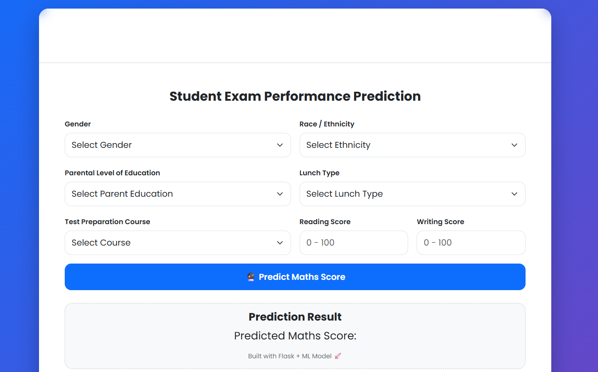
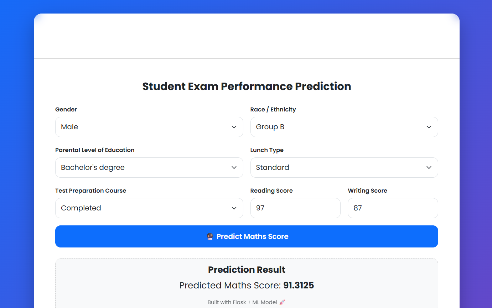

# End-to-End Machine Learning Project with Deployment 🚀

This repository contains an **end-to-end machine learning project** with a complete pipeline (data ingestion → transformation → model training → prediction) and a **Flask web application** for deployment.  
The project also supports deployment on **AWS Elastic Beanstalk** and can be extended to any cloud platform.

---

## 🔗 Live Demo
✅ Deployed Application: **<http://studentexamperformanceprediction-env-1.eba-wtw2naqz.ap-south-1.elasticbeanstalk.com/predictdata>**  
Example: https://your-app-url.com

---

## 📌 Project Features
- ✅ Complete End-to-End ML Pipeline
- ✅ Model training + artifact saving
- ✅ Prediction pipeline integration with Flask UI
- ✅ Logs and training info tracking
- ✅ Hyperparameter training using CatBoost
- ✅ Clean modular project structure (`src/`)
- ✅ AWS Elastic Beanstalk deployment support (`.ebextensions/`)

---

## 🧠 Tech Stack
- **Language:** Python
- **ML / DS:** NumPy, Pandas, Scikit-learn, CatBoost
- **Web Framework:** Flask
- **Deployment:** AWS Elastic Beanstalk (with `.ebextensions`)
- **Tools:** Git, GitHub

---

## 📂 Repository Structure
```bash
.
├── .ebextensions/             # AWS Elastic Beanstalk deployment configurations
├── artifacts/                 # Saved model, preprocessor & outputs
├── catboost_info/             # CatBoost training logs
├── notebook/                  # EDA & experimentation notebooks
├── src/                       # Source code (ML pipeline + prediction logic)
├── templates/                 # Flask HTML templates (UI)
├── .gitignore
├── README.md
├── application.py             # Flask app entry point
├── requirements.txt           # Python dependencies
└── setup.py                   # Package setup
```
## 📸 Screenshots


